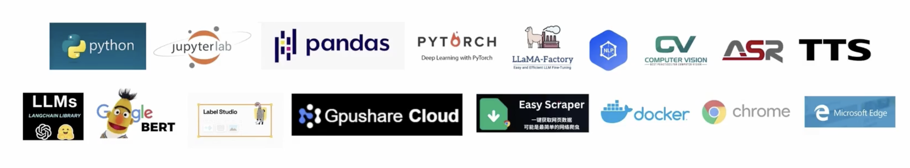

## Tech Stack

### Programming Languages & Development Environment
- Python
- JupyterLab

### Data Processing & Analysis
- Pandas

### Deep Learning Framework
- PyTorch

### Machine Learning & AI
- LLaMA-Factory
- NLP (Natural Language Processing)
- Computer Vision (CV)
- ASR TTS (Automatic Speech Recognition & Text-to-Speech)
- LLMs (LangChain Library)
- Google BERT

### Data Annotation & Tools
- Label Studio

### Cloud Services
- Gpushare Cloud

### Web Scraping
- Easy Scraper

### Containerization
- Docker

### Browsers
- Chrome
- Microsoft Edge

## Getting Started

### Setup Virtual Environment

```bash
python3 -m venv venv
source venv/bin/activate  # On Windows: venv\Scripts\activate
```

### Install Dependencies

Install all dependencies from `requirements.txt`:

```bash
pip install -r requirements.txt
```

Or install Label Studio only:

```bash
pip install label-studio
```

### Start Label Studio

```bash
source venv/bin/activate  # Activate virtual environment first
label-studio
```

Label Studio will be available at `http://localhost:8080`
